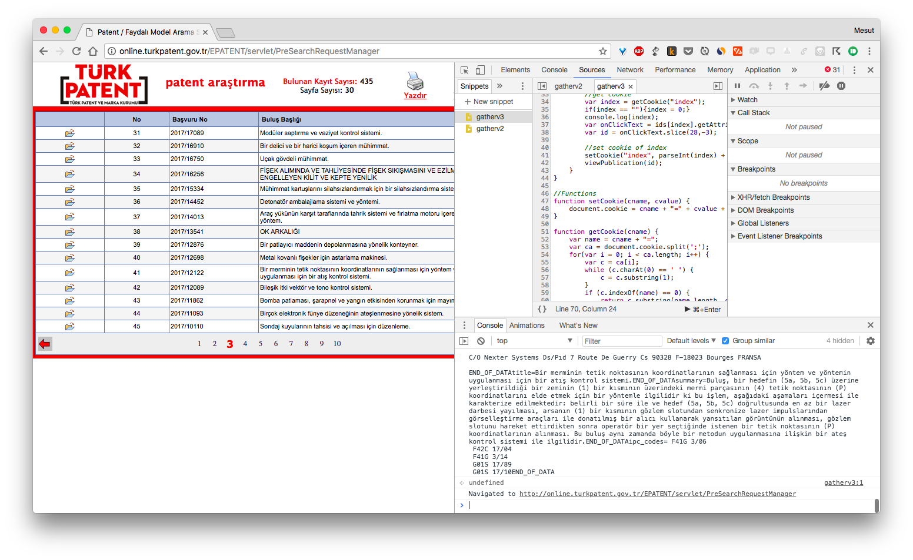

# F42 SNA Patent Analysis

This is my B.Sc thesis project repo, subjected to patent analysis for F42 _"Ammunition and Blasting"_ patent group with **Social Network Analysis** method by **Gephi** application.

Please check [the paper](https://github.com/imesut/f42/blob/master/paper.pdf) for detailed methodology, literature research and conclusion.

Check the presentation at [bit.ly/f42presentation](http://bit.ly/f42presentation)

Take a look at state of F42 technologies in Turkey from descriptive statistics from [descriptive images directory](https://github.com/imesut/f42/tree/master/images/descriptive_images).

Repeat [visualizations](https://github.com/imesut/f42/tree/master/images/sna_images) by downloading [gephi formatted file](https://github.com/imesut/f42/blob/master/social_network.gephi) and repeating visualization algorithms.

## Data Preparation

1. **Collector** gathering script(JavaScript) is running on browser and genrating a console log. Check gather [script here.](https://github.com/imesut/f42/blob/master/scripts/collector.js)

	
	_Cleaner Script is runned from browser_

2. **Cleaner** script(Python) is running from local and organizes console log to structured format, ready to analyse in Gephi. Check cleaner [script here.](https://github.com/imesut/f42/blob/master/scripts/cleaner.py)